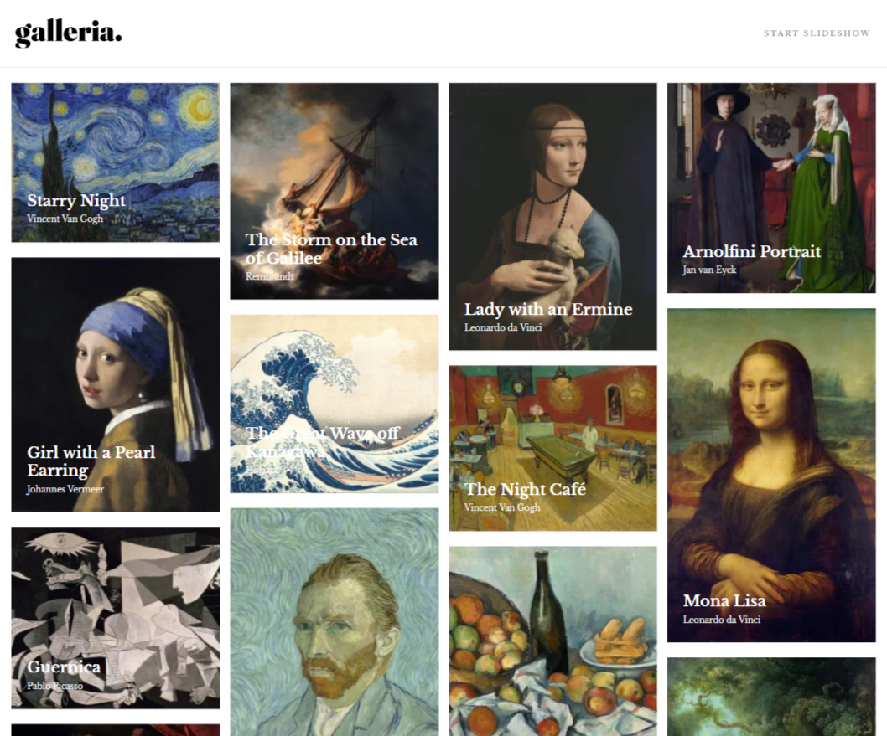

# Galleria Slideshow Site

## Table of contents

- [Overview](#overview)
  - [The challenge](#the-challenge)
  - [Screenshot](#screenshot)
  - [Links](#links)
- [My process](#my-process)
  - [Built with](#built-with)
  - [What I learned](#what-i-learned)
  - [Continued development](#continued-development)
- [Author](#author)

## Overview

### The challenge

Users should be able to:

- View the optimal layout for the app depending on their device's screen size
- See hover states for all interactive elements on the page
- Navigate the slideshow and view each painting in a lightbox

### Screenshot



### Links

- Live Site URL: [Galleria Art](https://galleria-art.vercel.app/)

## My process

### Built with

- [Next.js](https://nextjs.org/) - React framework
- [Styled Components](https://styled-components.com/)
- SCSS/Sass
- Mobile-first workflow
- React Redux
- Framer Motion

### What I learned

This was definitely one of those projects you'll go into thinking it should be easy, but quickly becomes more and more complex.

At first glance, the main page looked trival. I started with a mobile first layout and scaled up to the tablet version of the application. The pictures were all different heights which led to me discorvering implementations for a Masonry layout.

Traditionally, it requires some JavaScript implementation through use of a library. Firefox Nightly currently hosts a function for developers,

```css
grid-row-template: masonry;
```

that will be available to browers in the near future, so I opted for an easier implementation with css:

```css
 @media ${(props) => props.theme.tablet} {
    display: column;
    margin: 0 auto;
    columns: 2;

    & > * {
      break-inside: avoid;
      margin-bottom: 1em;
    }
  }

 @supports (grid-template-rows: masonry) {
    @media ${(props) => props.theme.tablet} {
      display: grid;
      gap: 1em;
      grid-template-columns: repeat(2, 1fr);
      grid-template-rows: masonry;

      & > * {
        margin-bottom: 0em;
      }
    }
  }
```

As more browsers support this function, my webpage will automatically correct the picture order.

The next challenge dealt with the carousel on the next page. I originally tried mapping in a slide component to view the style of the webpage, but realized that I would need to read in state changes when a button is clicked.

The data is fairly complex, so creating multiple slides on one page and translating them into a view window did not seem like a viable option.

For the modal, I decided to use a package called react-modal. It's decent, but it becomes apparent that the modal lacks some features for dynamic sizing to fit the width and height of varying pictures. This package can be useful for single use cases that do not require handling for state changes.

### Continued development

I had a chance to try out the Framer-Motion library which is excellent. Typically I had defaulted to using react-reveal, but it doesn't offer as much control.

You can even input custom functions that animate as your component is removed from the React tree. I'll definitely use it again.

## Author

- Website - [Jason Nembhard](https://www.jasonnembhard.com)
